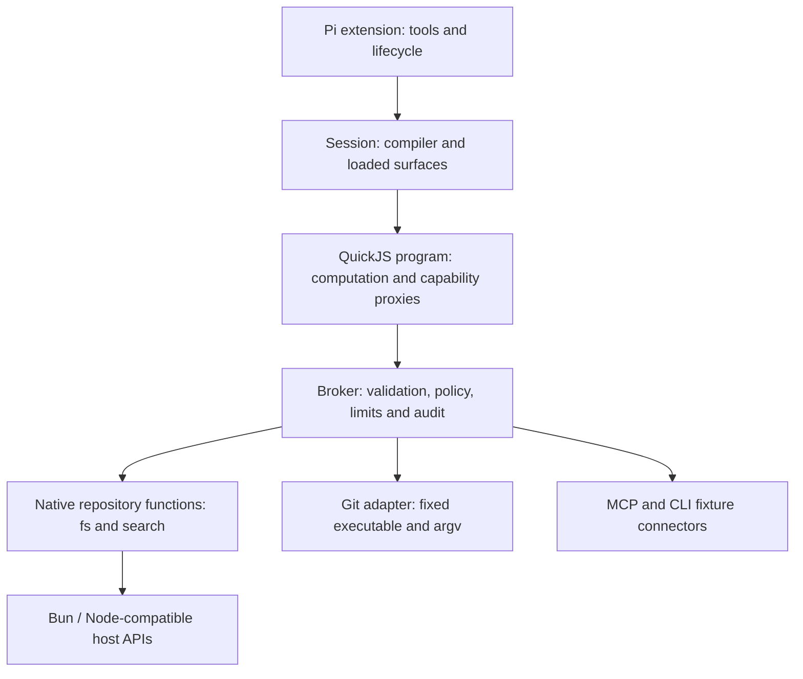

# Strata: architecture and concept design

Status: proposed direction, 2026-09-05. This ACD describes the next experiment; [ARCHITECTURE.md](ARCHITECTURE.md) describes the implementation at `5079c4d`. [Research](docs/research/typed-agent-prior-art.md) supplies external evidence; [evaluation](docs/evaluation.md) defines how to challenge the proposal. Implementation slices live in the local `.work/issues/` board.

## Product question

Can a coding agent complete real repository work more reliably or cheaply by composing typed operations in small TypeScript programs? Strata tests that question inside Pi, retaining its model integration and agent loop. The desired improvement is less work spent constructing shell strings, parsing output, recovering from interface mistakes, and moving intermediate data through model context.

The value is an experiment, not an assumed superiority of TypeScript. Bash already composes well and models have extensive experience with CLI conventions. Python/IPython offers another capable programming environment. A negative result that explains where typed interfaces help or hurt, and teaches us about Pi and harness design, is a successful project outcome.

The initial target user is a developer experimenting with a local coding agent. Multi-tenant hostile-code hosting, a new agent loop, a universal Unix replacement, a package manager, and autonomous harness optimization are outside the next slice.

## What exists and what does not

The prototype has compile-before-execute programs, schema-derived declarations, runtime validation, per-module operation allowlists, MCP and fixture CLI connectors, fresh QuickJS execution, and lexical capability search/load. It has no native repository operations, parameter-aware permission rules, interactive grants, strict typed-only tool profile, or persistent Python/TS notebook state.

The 41 current tests validate this mechanism. The historical 12-cell fixture benchmark is an exploratory pilot; byte reduction and 9/12 accepted cells do not establish task-level advantage. Condition D was a separate discovery demonstration; the committed benchmark runner only implements A/B/C.

## Shell avoidance has three meanings

1. **No model-authored shell:** the agent calls `git.status()` instead of constructing `git status` text. This is the next experiment's target.
2. **No shell interpreter anywhere in the operation:** an adapter may call a fixed Git executable with an argument array. This is compatible with the first goal and preferred where practical. Bun's shell API still implements shell semantics; it is not a native replacement for them.
3. **No subprocesses:** replace Git, search engines, compilers and test runners with libraries. This is a separate, much larger goal with no present justification.

Prefer Bun/Node-compatible native functions for filesystem operations and normal JavaScript for data transformations. Preserve mature engines behind narrow adapters when reproducing their semantics would cost more than it helps. A generic `bash()` remains a possible, separately authorized fallback experiment, disabled in the strict condition. Stock Pi tools remain available today; prompt instructions alone do not enforce their removal.

## Start from a caller workflow

The user's example reads a package manifest, inspects source/test/work directories, reads an optional issue board, and obtains Git history/status. Its intent is repository orientation. Treat it as a composition of bounded reads, not a request to clone `cat`, `ls`, `head`, and every CLI flag.

Illustrative future API; this does **not** run on today's fixture capabilities:

```ts
import { api as fs } from "@cap/fs";
import { api as git } from "@cap/git";

export async function main() {
  const [packageFile, src, tests, work, issues, history, status] =
    await Promise.all([
      fs.readText({ path: "package.json", maxBytes: 16_384 }),
      fs.list({ path: "src", depth: 3, limit: 80 }),
      fs.list({ path: "test", depth: 3, limit: 80 }),
      fs.list({ path: ".work", depth: 2, limit: 80 }),
      fs.readText({ path: ".work/issues/index.md", maxBytes: 12_288 }),
      git.log({ limit: 20 }),
      git.status({ untracked: "normal" }),
    ]);
  return { packageFile, src, tests, work, issues, history, status };
}
```

The reads return structured results, including missing-path outcomes and explicit incompleteness. The agent selects smaller ranges or summarizes if the final report exceeds its budget. This example bounds individual requests; it does not promise their combined response fits. `Promise.all` overlaps independent calls; it provides neither a repository snapshot nor rollback. Dependencies use ordinary `await`; partial-result workflows can use `Promise.allSettled`. A broker concurrency cap must prevent an unbounded fan-out from spawning host work.

Do not initially add `inspectRepository()` with hardcoded `src/test/.work` conventions. Reusable primitives plus short compositions will show which repeated workflow deserves a higher-level function.

## Proposed API contracts

Use small domain modules: `fs`, `search`, `git`, later `workspace` edits and `project` checks. Retain existing `@cap/<id>` imports and `api` exports initially; aliases already provide readable namespaces. Avoid a new function DSL or one module per Unix command.

| Need / familiar commands | Proposed operations | Implementation direction |
| --- | --- | --- |
| `cat`, `head`, `tail`, `stat` | `fs.readText`, `fs.stat`; add tail only with demand | Bun file reading / `node:fs`; bounded ranges, explicit encoding and binary behavior |
| `ls`, `find`, filename globs | `fs.list`, `fs.find` | Directory APIs / `Bun.Glob`; explicit hidden, ignore, symlink and depth semantics |
| `rg`, `grep` | `search.text` | Start with literal query and path filters; assess native scan vs pinned ripgrep JSON adapter |
| `jq`, `cut`, `sort`, `uniq`, `wc`, `xargs` | Ordinary arrays, maps, sets, strings and bounded async composition | No broker call for pure transformations; document numeric/string ordering |
| `git status/log/diff/show` | `git.status`, `git.log`, `git.diff`, `git.show` | Fixed Git argv, stable machine formats; parse paths safely and bound output |
| `sed -i`, `cp`, `mv`, `mkdir`, patching | `workspace.applyEdits`, purposeful filesystem mutations | Later phase: preconditions, diff preview, scoped writes and clear partial effects |
| tests, build, formatter, package manager | `project.runCheck` with named trusted profiles | Later phase: subprocesses, output caps, process-tree cancellation, effect policy |
| `curl`, archives, remote services | Task-specific operations when evidence warrants | Defer generic network and archive surfaces; bound destinations/extraction roots |

Prioritize by workflow coverage, observed failures and result-volume burden, not frequency alone. Session analysis may show that a few Git/read/search functions cover most demand, or that long-tail shell use makes strict mode impractical.

An initial result convention could be:

```ts
type ReadTextResult =
  | { kind: "text"; text: string; revision: string;
      complete: boolean; nextLine?: number }
  | { kind: "notFound"; path: string }
  | { kind: "binary"; path: string };

type Page<T> = {
  items: T[];
  complete: boolean;
  continuation?: string;
};
```

These are sketches, not a universal envelope requirement. Finalize contracts with representative callers before implementation. Listing/search results need stable ordering, normalized relative paths and a reason when incomplete. `complete: false` without a continuation must say how to narrow the request. Line numbers are one-based; byte caps count UTF-8; limits have runtime minima/maxima. Explicit reads of ignored files are distinct from default discovery excluding them—`.work/` being gitignored must not make it unreadable when authorized.

JSON parsing returns `unknown` unless a schema or narrowing validates it; `readJson<T>()` cannot honestly promise a caller-selected type. Native JS `RegExp` is not ripgrep's regex engine. Recursive listing is not ignore-aware search. A version hash can support later edit conflict detection; it does not make several independent reads a transaction. Special files, huge files, invalid encodings, symlink loops, filenames with newlines and permission failures require explicit behavior.

Keep expected outcomes such as missing optional files in result unions. Policy denial, invalid input, cancellation and adapter failure need machine-readable error categories plus bounded messages. Today's broker throws formatted strings; structured error details are future work. Never silently turn access denial into `notFound`, drop failure with `catch(() => [])`, or retry a mutation whose outcome is unknown.

## Implementation responsibilities



`src/session.ts` remains the composition root. The compiler owns program diagnostics and emission, not permissions. The runtime owns isolated execution and message lifetimes, not Git semantics. The broker owns invocation policy and metrics. Each repository operation owns domain semantics and translation to its library/process backend. Trusted configuration selects roots, adapters and grants.

Add a small native implementation of the existing `CapabilityConnector` contract; do not simulate a CLI or MCP server to call local functions. Add a trusted built-in catalog binding for native entries when needed. Keep schemas as the current public contract authority, generating declarations and validating runtime inputs/outputs from them. If handwritten implementation types duplicate those schemas, parity/contract tests are required. Consider TS-first schema tooling only after a concrete authoring problem appears; arbitrary TypeScript cannot be losslessly translated to runtime validation.

General npm/Bun packages execute in the trusted host adapter, not inside the QuickJS program. Whitelisting a package import by name is not a safety argument: dependencies can access host APIs and run initialization code. Broker bindings expose only the deliberate operation contract. Pure ECMAScript utilities need no new capability; importing arbitrary libraries into generated programs remains deferred.

## Authorization and enforcement

The user's intuition is directionally right: both shell and typed approaches need a decision about actions and resources. Typed arguments make that decision easier to express, but switching signatures does not preserve the enforcement mechanism automatically. Types are erased, casts bypass static checks, and a function named `readOnly` can still have side effects. Current operation-name allowlists cannot constrain `fs.readText` to an approved root.

Proposed invocation flow: resolve an installed operation → validate and bound input → derive canonical resources/effects using trusted code → evaluate policy → obtain a scoped decision if required → enforce the decision at the resource boundary → perform the operation → validate and bound output → emit a redacted audit event. Preserve the current fast rejection of unknown/unallowed operation names. Catalog loading and invocation are separate: importing a connector executes trusted host code even before an agent invokes an operation.

Policy identity includes the session/operator delegation, capability and operation version, action, canonical resource, relevant parameters and current context. Use `allow`, `deny`, or `ask`; grants may be once or session scoped and must be invalidated when their scope changes. A review prompt should describe the concrete action/root/diff, not ask to approve an opaque TypeScript program. Nested calls need enforcement inside the broker: Pi's outer `tool_call` hook only sees `typed_program`.

Examples: allow `fs.readText` inside the selected workspace with a byte cap; deny configured secret paths even when under that root; ask for an additional read root; allow a reviewed patch only against the expected file revision. These examples describe policy, not an implemented UI. Directory names and substring prefixes are insufficient containment checks. Resolve traversal and symlinks; defend against races between path checks and file opening. A canonical-path check alone is only a best-effort prototype guard. Strong guarantees need OS-enforced filesystem isolation or safe handle-relative operations, with explicit platform limits.

Running `project.runCheck({ name: "test" })` executes repository-defined code, which may spawn children, write files or contact the network. It is not a harmless read because its API is narrow. Git configuration, external diff/textconv helpers, credentials and environment can also alter effects; use explicit command profiles and controlled configuration. Argument arrays avoid shell interpolation but do not prevent option injection or malicious program semantics. No automatic grant inheritance through dependency or supersession edges.

For a small local read-only experiment, trusted adapters plus scoped checks and honest limitations are acceptable. Before enabling mutations or claiming resistance to hostile repositories, choose and test a stronger enforcement boundary. Keep host/compiler allocations bounded separately from QuickJS memory. Cancel pending approval on abort; do not silently rerun an entire program after approval because earlier operations may already have completed. No implicit transaction or rollback guarantee.

## Alternatives and decisions

| Alternative | Decision / revisit trigger |
| --- | --- |
| Improve stock Pi prompts and shell recipes only | Keep as a strong baseline; it may win through familiar interfaces and low overhead |
| Execute generated TS directly in Bun | Defer: native ergonomics come with ambient host authority unless an external sandbox enforces policy; changing runtime also confounds evaluation |
| Current QuickJS plus narrow native adapters | Recommended next slice: reuse the working compiler/broker while adding useful repository semantics |
| Wrap all Unix commands one-for-one | Reject as the design goal: preserves incidental flags and parsing; support actual workflows incrementally |
| Persistent TypeScript REPL like IPython | Defer until rerun costs/state needs are measured; adds hidden state, replay and invalidation burdens |
| Automatically resolve dependency/supersession graphs | Defer; static related metadata is enough until discovery evidence demands more |

Supersession means a declared compatibility/replacement relationship, not the same thing as a runtime dependency or useful companion. A tool may supersede only part of another's behavior. Later metadata would need version/scope and migration evidence; it must never silently change permissions or route calls.

## Delivery and decision gates

1. Repair Pi cancellation propagation and the benchmark evaluator; freeze old artifacts as pilot history.
2. Define scoped read policy and native contracts; optionally use a bounded session sample to refine priorities.
3. Deliver the repository-orientation composition through typed reads/list/search and Git status/log. Enforce a strict tool profile and record shell/subprocess/native execution separately.
4. Evaluate real tasks, with repeated stock-Pi comparisons, a typed single-call ablation, composed typed mode, and a separately pinned Prime/IPython comparison. Keep a development set and untouched task families for evaluation.
5. Decide to continue, narrow the use case, pivot to improving stock Pi, or stop. Add editing, check runners, persistence or richer discovery only when the measured bottleneck justifies them.

The decision criteria, failure taxonomy and evidence artifact contract are in [the evaluation plan](docs/evaluation.md). No paid experiment or implementation beyond documentation is implied by this plan.
