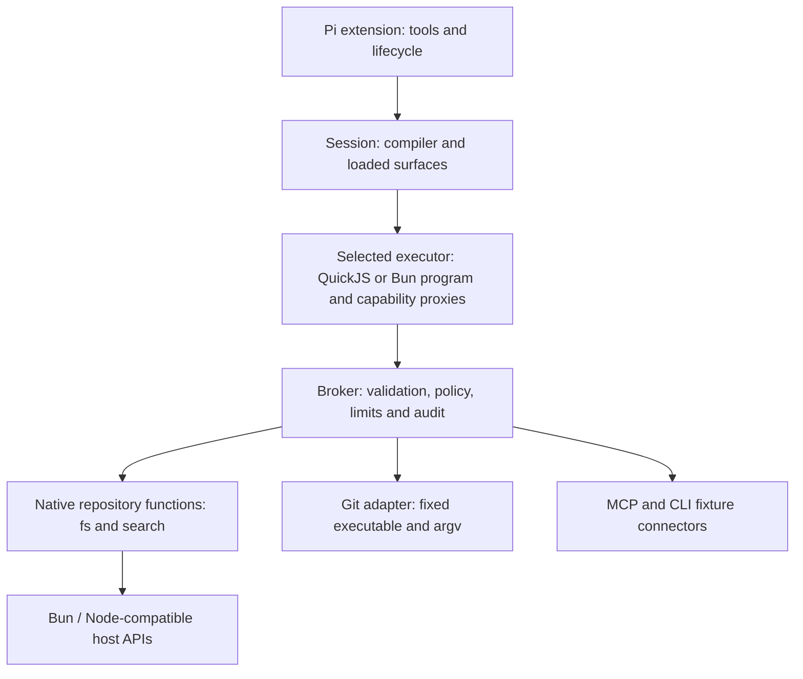

# Strata: architecture and concept design

Status: architectural direction reviewed 2026-09-06 against `807562a` and repo-2 artifacts. This ACD separates implemented contracts from proposed experiments; [ARCHITECTURE.md](ARCHITECTURE.md) describes the implemented system. [Research](docs/research/typed-agent-prior-art.md) supplies external evidence; [evaluation](docs/evaluation.md) defines how to challenge the proposal. Implementation slices live in the tracked `.work/issues/` board.

## Product question

**Revised architectural decision (2026-09-05):** The enduring architecture is the typed capability layer: discoverable contracts, semantic checking, composable repository/API/MCP functions, runtime validation, permission-aware implementations and observability. The execution engine is an implementation choice. QuickJS remains the implemented baseline; direct Bun is implemented as an opt-in alternative; no proof of QuickJS slowness was required. Execution containment is a separate concern. This documentation decision does not itself implement or select a runtime migration.

Can a coding agent complete real repository work more reliably or cheaply by composing typed operations in small TypeScript programs? Strata tests that question inside Pi, retaining its model integration and agent loop. The desired improvement is less work spent constructing shell strings, parsing output, recovering from interface mistakes, and moving intermediate data through model context.

The value is an experiment, not an assumed superiority of TypeScript. Bash already composes well and models have extensive experience with CLI conventions. Python/IPython offers another capable programming environment. A negative result that explains where typed interfaces help or hurt, and teaches us about Pi and harness design, is a successful project outcome.

The initial target user is a developer experimenting with a local coding agent. Multi-tenant hostile-code hosting, a new agent loop, a universal Unix replacement, a package manager, and autonomous harness optimization are outside the next slice.

## What exists and what does not

The prototype has compile-before-execute programs, schema-derived declarations, runtime validation, per-module operation allowlists, MCP and fixture CLI connectors, fresh QuickJS execution with an opt-in direct-Bun executor behind the same contract, and lexical capability search/load. The native repository capability covers `readText` (with line ranges), `searchText` (with glob filters), `listFiles`, `gitStatus`, `gitLog` (with per-commit files), `gitDiff` and `gitShow`, with root scoping, caps, truncation hints and a versioned trace. It has no parameter-aware mutation grants, interactive grants, strict typed-only tool profile beyond `STRATA_STRICT`, or persistent Python/TS notebook state.

The deterministic suite (148 tests and typecheck, verified in this review) validates this mechanism; see [handoff](docs/handoff.md) for trial history. The historical 12-cell fixture benchmark is an exploratory pilot; byte reduction and 9/12 accepted cells do not establish task-level advantage. Condition D was a separate discovery demonstration; the current runner implements A/B/C. [Protocol v2](docs/benchmark.md) now repairs grading and adds conservative request budgets and cold repeats, without a paid v2 baseline.

## Shell avoidance has three meanings

1. **No model-authored shell:** the agent calls `git.status()` instead of constructing `git status` text. This is the next experiment's target.
2. **No shell interpreter anywhere in the operation:** an adapter may call a fixed Git executable with an argument array. This is compatible with the first goal and preferred where practical. Bun's shell API still implements shell semantics; it is not a native replacement for them.
3. **No subprocesses:** replace Git, search engines, compilers and test runners with libraries. This is a separate, much larger goal with no present justification.

Prefer Bun/Node-compatible native functions for filesystem operations and normal JavaScript for data transformations. Preserve mature engines behind narrow adapters when reproducing their semantics would cost more than it helps. A generic `bash()` remains a possible, separately authorized fallback experiment, disabled in the strict condition. Stock Pi tools remain available today; prompt instructions alone do not enforce their removal.

## Start from a caller workflow

The user's example reads a package manifest, inspects source/test/work directories, reads an optional issue board, and obtains Git history/status. Its intent is repository orientation. Treat it as a composition of bounded reads, not a request to clone `cat`, `ls`, `head`, and every CLI flag.

Illustrative future API; this does **not** run on today's fixture capabilities:

```ts
import { api as fs } from "@cap/fs";
import { api as git } from "@cap/git";

export async function main() {
  const [packageFile, src, tests, work, issues, history, status] =
    await Promise.all([
      fs.readText({ path: "package.json", maxBytes: 16_384 }),
      fs.list({ path: "src", depth: 3, limit: 80 }),
      fs.list({ path: "test", depth: 3, limit: 80 }),
      fs.list({ path: ".work", depth: 2, limit: 80 }),
      fs.readText({ path: ".work/issues/index.md", maxBytes: 12_288 }),
      git.log({ limit: 20 }),
      git.status({ untracked: "normal" }),
    ]);
  return { packageFile, src, tests, work, issues, history, status };
}
```

The reads return structured results, including missing-path outcomes and explicit incompleteness. The agent selects smaller ranges or summarizes if the final report exceeds its budget. This example bounds individual requests; it does not promise their combined response fits. `Promise.all` overlaps independent calls; it provides neither a repository snapshot nor rollback. Dependencies use ordinary `await`; partial-result workflows can use `Promise.allSettled`. A broker concurrency cap must prevent an unbounded fan-out from spawning host work.

Do not initially add `inspectRepository()` with hardcoded `src/test/.work` conventions. Reusable primitives plus short compositions will show which repeated workflow deserves a higher-level function.

## Proposed API contracts

Use small domain modules: `fs`, `search`, `git`, later `workspace` edits and `project` checks. Retain existing `@cap/<id>` imports and `api` exports initially; aliases already provide readable namespaces. Avoid a new function DSL or one module per Unix command.

| Need / familiar commands | Proposed operations | Implementation direction |
| --- | --- | --- |
| `cat`, `head`, `tail`, `stat` | `fs.readText`, `fs.stat`; add tail only with demand | Bun file reading / `node:fs`; bounded ranges, explicit encoding and binary behavior |
| `ls`, `find`, filename globs | `fs.list`, `fs.find` | Directory APIs / `Bun.Glob`; explicit hidden, ignore, symlink and depth semantics |
| `rg`, `grep` | `search.text` | Start with literal query and path filters; assess native scan vs pinned ripgrep JSON adapter |
| `jq`, `cut`, `sort`, `uniq`, `wc`, `xargs` | Ordinary arrays, maps, sets, strings and bounded async composition | No broker call for pure transformations; document numeric/string ordering |
| `git status/log/diff/show` | `git.status`, `git.log`, `git.diff`, `git.show` | Fixed Git argv, stable machine formats; parse paths safely and bound output |
| `sed -i`, `cp`, `mv`, `mkdir`, patching | `workspace.applyEdits`, purposeful filesystem mutations | Later phase: preconditions, diff preview, scoped writes and clear partial effects |
| tests, build, formatter, package manager | `project.runCheck` with named trusted profiles | Later phase: subprocesses, output caps, process-tree cancellation, effect policy |
| `curl`, archives, remote services | Task-specific operations when evidence warrants | Defer generic network and archive surfaces; bound destinations/extraction roots |

Prioritize by workflow coverage, observed failures and result-volume burden, not frequency alone. Session analysis may show that a few Git/read/search functions cover most demand, or that long-tail shell use makes strict mode impractical.

An initial result convention could be:

```ts
type ReadTextResult =
  | { kind: "text"; text: string; revision: string;
      complete: boolean; nextLine?: number }
  | { kind: "notFound"; path: string }
  | { kind: "binary"; path: string };

type Page<T> = {
  items: T[];
  complete: boolean;
  continuation?: string;
};
```

These are sketches, not a universal envelope requirement. Finalize contracts with representative callers before implementation. Listing/search results need stable ordering, normalized relative paths and a reason when incomplete. `complete: false` without a continuation must say how to narrow the request. Line numbers are one-based; byte caps count UTF-8; limits have runtime minima/maxima. Explicit reads of ignored files are distinct from default discovery excluding them—`.work/` being gitignored must not make it unreadable when authorized.

Treat JSON parsing results as `unknown` until a schema or narrowing validates them (the standard JSON.parse typing is `any`); `readJson<T>()` cannot honestly promise a caller-selected type. Native JS `RegExp` is not ripgrep's regex engine. Recursive listing is not ignore-aware search. A version hash can support later edit conflict detection; it does not make several independent reads a transaction. Special files, huge files, invalid encodings, symlink loops, filenames with newlines and permission failures require explicit behavior.

Keep expected outcomes such as missing optional files in result unions. Policy denial, invalid input, cancellation and adapter failure need machine-readable error categories plus bounded messages. Today's broker throws formatted strings; structured error details are future work. Never silently turn access denial into `notFound`, drop failure with `catch(() => [])`, or retry a mutation whose outcome is unknown.

## Implementation responsibilities



`src/session.ts` remains the composition root. The compiler owns program diagnostics and emission, not permissions. The runtime owns isolated execution and message lifetimes, not Git semantics. The broker owns invocation policy and metrics. Each repository operation owns domain semantics and translation to its library/process backend. Trusted configuration selects roots, adapters and grants.

The native repository implementation uses the existing `CapabilityConnector` contract; do not simulate a CLI or MCP server to call local functions. Add a trusted built-in catalog binding for native entries when needed. Keep schemas as the current public contract authority, generating declarations and validating runtime inputs/outputs from them. If handwritten implementation types duplicate those schemas, parity/contract tests are required. Consider TS-first schema tooling only after a concrete authoring problem appears; arbitrary TypeScript cannot be losslessly translated to runtime validation.

General npm/Bun packages execute in the trusted host adapter, not inside the QuickJS program. Whitelisting a package import by name is not a safety argument: dependencies can access host APIs and run initialization code. Broker bindings expose only the deliberate operation contract. Pure ECMAScript utilities need no new capability; importing arbitrary libraries into generated programs remains deferred.

## Authorization and enforcement

The user's intuition is directionally right: both shell and typed approaches need a decision about actions and resources. Typed arguments make that decision easier to express, but switching signatures does not preserve the enforcement mechanism automatically. Types are erased, casts bypass static checks, and a function named `readOnly` can still have side effects. Operation-name allowlists alone cannot constrain reads to a root; current repository adapters additionally enforce best-effort root/cap policy.

Proposed invocation flow: resolve an installed operation → validate and bound input → derive canonical resources/effects using trusted code → evaluate policy → obtain a scoped decision if required → enforce the decision at the resource boundary → perform the operation → validate and bound output → emit a redacted audit event. Preserve the current fast rejection of unknown/unallowed operation names. Catalog loading and invocation are separate: importing a connector executes trusted host code even before an agent invokes an operation.

Policy identity includes the session/operator delegation, capability and operation version, action, canonical resource, relevant parameters and current context. Use `allow`, `deny`, or `ask`; grants may be once or session scoped and must be invalidated when their scope changes. A review prompt should describe the concrete action/root/diff, not ask to approve an opaque TypeScript program. Nested calls need enforcement inside the broker: Pi's outer `tool_call` hook only sees `typed_program`.

Examples: allow `fs.readText` inside the selected workspace with a byte cap; deny configured secret paths even when under that root; ask for an additional read root; allow a reviewed patch only against the expected file revision. These examples describe policy, not an implemented UI. Directory names and substring prefixes are insufficient containment checks. Resolve traversal and symlinks; defend against races between path checks and file opening. A canonical-path check alone is only a best-effort prototype guard. Strong guarantees need OS-enforced filesystem isolation or safe handle-relative operations, with explicit platform limits.

Running `project.runCheck({ name: "test" })` executes repository-defined code, which may spawn children, write files or contact the network. It is not a harmless read because its API is narrow. Git configuration, external diff/textconv helpers, credentials and environment can also alter effects; use explicit command profiles and controlled configuration. Argument arrays avoid shell interpolation but do not prevent option injection or malicious program semantics. No automatic grant inheritance through dependency or supersession edges.

For a small local read-only experiment, trusted adapters plus scoped checks and honest limitations are acceptable. Before enabling mutations or claiming resistance to hostile repositories, choose and test a stronger enforcement boundary. Keep host/compiler allocations bounded separately from QuickJS memory. Cancel pending approval on abort; do not silently rerun an entire program after approval because earlier operations may already have completed. No implicit transaction or rollback guarantee.

## Alternatives and decisions

| Alternative | Decision / revisit trigger |
| --- | --- |
| Improve stock Pi prompts and shell recipes only | Keep as a strong baseline; it may win through familiar interfaces and low overhead |
| Execute generated TS directly in Bun | Implemented opt-in comparison (`STRATA_EXECUTOR=bun`); contracts, checking and tracing preserved, ambient authority explicitly labeled cooperative ([comparison](docs/executors.md)) |
| Current QuickJS plus narrow native adapters | Implemented baseline and constrained execution option; not the mandatory future engine |
| Wrap all Unix commands one-for-one | Reject as the design goal: preserves incidental flags and parsing; support actual workflows incrementally |
| Persistent TypeScript REPL like IPython | Defer until rerun costs/state needs are measured; adds hidden state, replay and invalidation burdens |
| Automatically resolve dependency/supersession graphs | Defer; static related metadata is enough until discovery evidence demands more |

Supersession means a declared compatibility/replacement relationship, not the same thing as a runtime dependency or useful companion. A tool may supersede only part of another's behavior. Later metadata would need version/scope and migration evidence; it must never silently change permissions or route calls.

## Delivery and decision gates

Delivered: cancellation, scoped read contracts, repository usability, both executors, minimal tracing, quiet success, evaluator hardening and four repo-2 trial stages. Preserve these baselines rather than repeating their implementation.

1. **004 — attribute context cost, then test compact declarations.** Keep the full operation surface, checker, schema validation, grants and one executor fixed. Prompt/declaration size is a candidate explanation; quantify actual request components/cache usage before claiming causality. Do not select capabilities from hidden task answers.
2. **009 — independent confirmation.** Use new task families/repos after development tuning; the original held-out instances are now inspected regression data. Add a second model only after an affordable development signal. Sampling under 013/033 can identify realistic work without adding tools first.
3. **Decision — continue, narrow, pivot or stop.** Current results do not justify a general advantage or an aggregation-only win. Hybrid or structured-service use remains a hypothesis. Edits/checks, memory, caps, a new sandbox and catalog expansion are separately selected product experiments, not assumed remedies for the observed cost disadvantage.

See [trial report](docs/repo-trials.md), [evaluation](docs/evaluation.md) and [handoff](docs/handoff.md). This review makes no new paid run or feature implementation. Existing explicit authorization remains authoritative within its scope.

## Critical assessment and evidence priorities

Separate four hypotheses: structured operation contracts reduce interface mistakes; code composition reduces model round trips and intermediate context; semantic TypeScript checking prevents enough failed calls to justify its cost; mediated execution improves control and diagnosis. Success of one does not establish the others. Stock Pi must be allowed to compose shell commands and write Python/Bun scripts: the motivating semicolon-separated orientation command is already one execution. Compare total task effort, not an unfiltered baseline against a filtered Strata result.

Expect the strongest opportunity in predictable dependent operations and structured aggregation. Exploratory debugging needs intermediate observations and may benefit from shorter programs. A type-correct program can still search the wrong files or compute the wrong answer. Count declaration/source tokens, diagnostics, repair attempts, compile/runtime overhead and failures alongside reductions in returned data. A hybrid toolset is a credible product outcome; strict mode is also an experimental instrument for measuring capability gaps. Keep persistent state, broad catalogs and capability relationship machinery conditional on evidence.

For backend selection, start with native Bun APIs, then the Node-compatible standard library. Add a library only for a demonstrated semantic gap, material maintenance savings or measured benefit over the applicable built-in. Bun.Glob is the first path-discovery candidate; fast-glob is conditional. Native speed is not assumed, and milliseconds saved in an adapter must be assessed against end-to-end model latency. Preserve mature executables where their semantics earn the subprocess cost.

## Permission-aware functions and execution alternatives

Permission handling inside provided functions is part of the intended architecture. Keep common validation, operation grants and instrumentation in the broker; keep resource resolution and operation-specific enforcement in trusted implementations close to I/O. This avoids scattering independent approval systems across functions. The generated program may freely perform pure computation; the restriction concerns access to effects, not whether every function call belongs to our API.

Static source checks are useful early feedback, but do not by themselves make wrappers unavoidable. In a runtime with ambient filesystem, network or process authority, a program could access those facilities through globals or other reachable objects without an approved import. Type assertions and computed access also limit what syntax checks establish. Do not claim that checking imports, hiding declarations or scanning function names provides runtime confinement.

The present design combines restricted source imports with a QuickJS module loader exposing only loaded capability modules and explicit host bridges. Even direct use of the internal invocation bridge must pass the broker's validation and grants. Trusted host dependencies retain host authority; this is not OS isolation. Repository resource checks are best-effort and retain the documented path-check/open race limitation.

Three alternatives deserve distinct labels:

| Execution choice | What it provides / costs |
| --- | --- |
| QuickJS plus brokered Bun functions (current) | Deliberate host access surface; extra runtime, serialization and integration work |
| Direct Bun plus checked imports and permission-aware wrappers | Simpler experiment for cooperative code; ambient access can bypass wrappers, so neither complete enforcement nor complete tracing is established |
| Direct Bun inside an independently enforced sandbox | Potential native execution benefits; requires a concrete supported containment mechanism and equivalent resource policy, while direct operations still need instrumentation |

Evaluate direct Bun as a first-class alternative; simpler integration and native ergonomics are hypotheses alongside performance. Retain QuickJS for comparison, without making evidence of a bottleneck a prerequisite. A direct-Bun experiment must hold API/task/policy differences explicit and test bypasses as well as performance; it is not authorized by documenting the alternative. No language runtime speed claim substitutes for a task-level comparison.

Keep discovery, contracts, checking, broker policy and instrumentation independent of executor-specific handles/messages. Introduce only the small execution interface required by the second implementation: checked emitted code and capability bindings in; result, diagnostics, cancellation and trace events out. Direct Bun should start in a disposable worker/process, not evaluate generated code in Pi's host context. A worker is a lifecycle boundary, not filesystem/network containment. Preserve fresh-run semantics initially; persistence and disabling typechecking are separate experiments.

Record engine, tool profile and containment independently. Removing Pi's bash/read/write tools does not prevent a Bun program using ambient APIs. Such runs measure cooperative API adherence unless an independent enforcement mechanism establishes exclusivity. Use the same external restrictions as the scripting baseline where possible and document mismatches. Wrapper traces describe mediated calls, not proof of all effects.

## Observability: current foundation and missing contract

Source inspection on 2026-09-05 (`src/session.ts`, `src/capabilities/broker.ts`) found source bytes, aggregate compilation/execution durations, bounded diagnostics/logs, operation attempts, whether the connector was invoked, failure stages, raw result bytes and bytes exposed to Pi. Benchmark artifacts separately retain model requests and traces. Since 026 the trace adds versioned session/program/call correlation, per-operation durations, cancellation/timeout/denial categories, backend identity and an opt-in bounded JSONL sink; report truncation still means the model report cannot serve as the sole audit record.

Remaining gaps include queue/approval timing (no approvals exist yet), Pi model timing correlation without inventing unavailable measurements, and any telemetry platform beyond the local sink. Connector `transport` failures still cover raw adapter errors; `denied`/`cancelled` are classified structurally since 026, and `invoked` means connector entry, not proof that a filesystem or Git effect occurred. Report truncation can remove call detail, so the model report cannot serve as the sole audit record.

The versioned event contract and optional local JSONL sink are implemented; extend only for measured diagnostic gaps before considering a telemetry platform. Each attempted call needs a correlated outcome, monotonic duration, operation/backend identity, bounded size/completeness metadata and a machine-readable policy/error category. Distinguish queue, approval and adapter time when present; overlapping call durations cannot simply be summed into wall-clock time. Correlate with Pi model timing/usage where available, preserving missing values rather than reporting zero.

Default diagnostics should exclude raw file contents, arguments, source and secrets; resource metadata and errors need redaction too. Make detailed capture explicit and bounded, with retention and dropped-event counts. Define behavior when the sink fails; diagnostic collection and any future mandatory audit mode have different requirements. Trace replay must never automatically re-execute effects. Local issues 026/027 cover implementation and the runtime alternative; 012 owns resource authorization.

## Prior-art and handoff refinement

[Cloudflare Code Mode](docs/research/code-mode.md) shares the core tools-as-code mechanism. Strata's incremental question is whether semantic checking, purpose-designed local APIs and Bun-backed adapters earn their cost. A future checked/unchecked ablation must preserve schemas, runtime policy and task access; it is not a faithful Cloudflare runtime comparison. Prime's local source is available for studying persistence, feedback and orchestration separately from language choice.

The recommended next slice in [handoff](docs/handoff.md) is 004 context-cost attribution and concise declaration presentation, followed by independent confirmation. The earlier cancellation/read/executor/corpus/path-prefix sequences are delivered. QuickJS keeps Bun behind capability bridges; opt-in Bun retains ambient authority. The trial data show fewer calls at higher cost on this corpus, not the general superiority or failure of typed composition.
