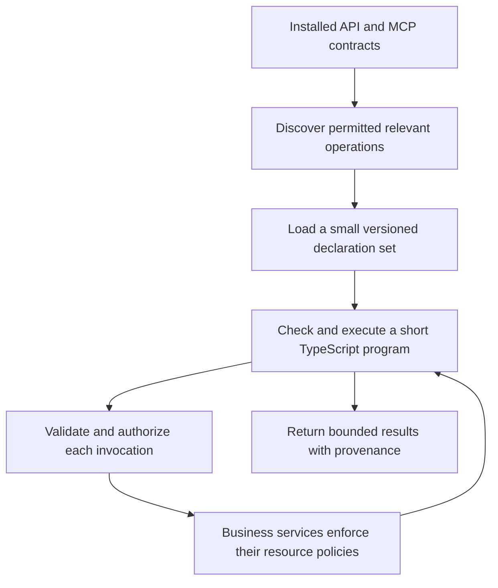

# Enterprise fit: typed composition over existing API contracts

Status: concept and proposed experiment, 2026-09-06. No enterprise capability, benchmark or security guarantee is delivered by this document. [Primary-source research](research/enterprise-capability-scaling.md) supports the external facts; [issue 035](../.work/issues/035-enterprise-capability-scaling.md) owns possible implementation. This is a separate fit hypothesis and does not interrupt the selected 004 context-cost work.

## Assessment

Dynamic enterprise applications are a plausible stronger fit than replacing familiar local CLI workflows. Existing structured APIs can reduce adapter-design and parsing work; unfamiliar, customer-specific operations make runtime discovery useful; cross-service joins can keep intermediate data away from the model. These are reasons to test, not evidence of superiority. Our repository trials found higher typed cost on their tested tasks and do not settle this domain.

The customer may expose thousands of operations, but most individual tasks need a small working set. Catalog size alone does not make code composition valuable: lazy direct-tool discovery can also keep irrelevant schemas out of context. The additional typed-program benefit must come from composition, data handling or checking.

## Existing APIs are an advantage

Where the customer already maintains accurate OpenAPI/JSON Schema contracts, reuse them as the source for operation identity, parameter/result structure and generated declarations. Reuse mature clients where appropriate. Unlike a CLI wrapper, we may not need to infer structure from terminal text or design each operation from scratch. OpenAPI-to-TypeScript-to-capability generation can amortize integration work across many operations. See the [OpenAPI research note](research/enterprise-capability-scaling.md#existing-contracts-change-the-integration-economics).

Do not assume every contract is complete or correct, or that every API is JSON-only. Define supported dialects, references, unions, parameter serialization, pagination, errors and binary/streaming responses. Unsupported/unknown output must remain honest instead of becoming an invented type. Runtime validation stays necessary. Existing contracts reduce interface plumbing; they do not automatically supply concise agent documentation, business semantics or safe operational policy.

Two services can both expose `customerId: string` while using different identifiers. Amounts can use different currencies or units. Types help shape correctness; adapters, metadata and domain rules still carry these relationships. Avoid a universal enterprise data model until actual integrations demand one.

## Intended flow

Example: identify customers with overdue invoices and open priority support cases, then return account owners and exposure grouped by customer. The program can follow pagination, map identifiers and aggregate bounded data without asking the model to process every invoice. Use service-side filters and batch endpoints first; fetching everything to demonstrate local filtering is poor design. A draft report is a suitable first task; sending messages or changing account state introduces a separate approval/recovery problem.

## Dynamic changes require distinct handling

| Change | Proposed response |
| --- | --- |
| New connector or operation | Refresh discovery metadata; load declarations only if needed |
| Schema revision | Bind/check against an explicit supported version; reject or refresh stale calls |
| Role, tenant, record permission or admin disablement | Recheck current authority at invocation; cached declarations never act as a grant |
| Credential expiry or rate limit | Structured failure/recovery with explicit retry bounds |
| Business data update | Normal fresh data reads; no automatic declaration rebuild |

A stable contract snapshot helps the compiler; it does not freeze permissions. Cache schema identity separately from principal/tenant policy context, avoid cross-user metadata leaks, and define what happens to in-flight operations. Revocation cannot undo accepted external writes, and replaying an entire program can duplicate prior effects.

The current Strata broker is a starting point, not this complete control system. It has static operation grants, additive loading and repository-specific checks. Dynamic schema replacement, enterprise resource policy, revocation, approval resumption and reliable cross-service effects remain unimplemented. QuickJS limits exposed host access; direct Bun is cooperative unless another boundary restricts ambient authority. Neither mode alone creates enterprise isolation.

## Where it may fit, and where it may not

| More promising | Less promising |
| --- | --- |
| Unfamiliar structured APIs across several services | One familiar lookup or an endpoint already returning the final aggregate |
| Several predictable dependent calls, pagination and joins | Model judgment or human approval needed after nearly every result |
| Large intermediate responses, small useful final result | Large outputs that must all reach the model or be exported unchanged |
| Large catalog, small discoverable working set | Loading the entire enterprise SDK into every prompt |
| Ad hoc read/report workflows with reusable contracts | Stable frequent processes better implemented as maintained workflows |
| Good schemas and explicit business relationships | Poor descriptions, schema drift and ambiguous cross-service semantics |

Enterprise scaling has several independent costs: retrieval quality, visible context, compiler work, upstream latency/rate limits, policy freshness and integration maintenance. A small interface-token count is not a total task-cost result. Operational tracing must identify discovery, compilation, calls, policy decisions and partial failures while controlling sensitive data capture.

## Proposed evidence gate

Start with three synthetic services and a few real-shaped operations, then vary distractor catalog size, workflow depth and payload independently. Include single-call and server-aggregated controls. Compare lazy direct tools with typed composition using identical discovery, schemas, backend data and authorization; all-schemas-in-prompt is only an additional diagnostic. Test permission revocation and schema changes between discovery and invocation with independent mock effect counters.

Measure task success, total context/cost/latency, retrieval recall, call counts, unauthorized effects, recovery and schema onboarding effort. A second stage can sample one real customer's contracts, with authorization, to test schema quality and integration burden. Build broader enterprise machinery only if these results justify it. A useful niche, no improvement, or a negative result are all valid outcomes.
